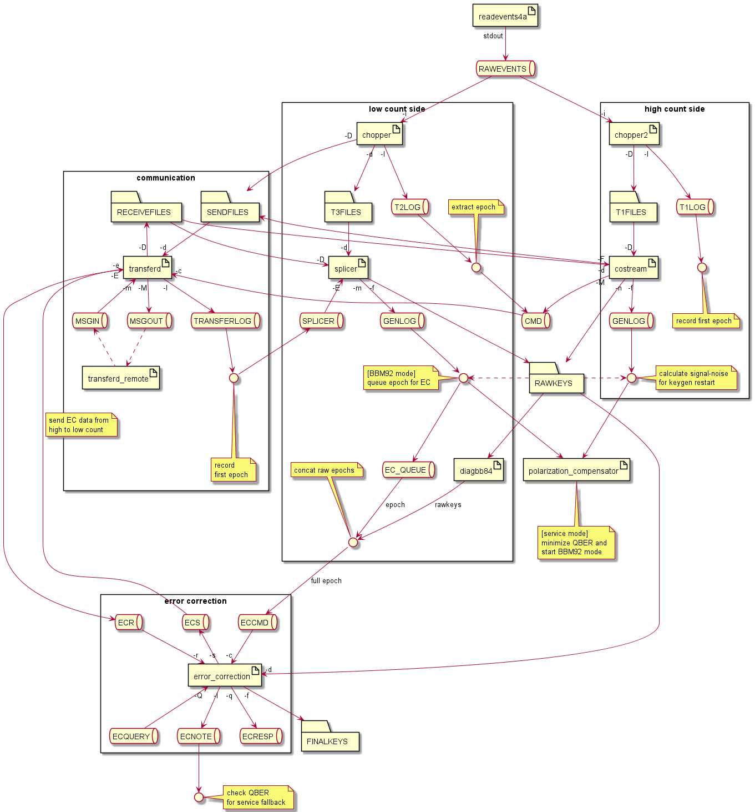

# QKD Server

This package takes care of the s-fifteen QKD-based key generation business logic. 
It ties together the quantum channel and the classical channel and generates encryption keys ready for consumption.

> Note that this library is still in beta: the devices used to communicate with QKD server are currently compatible with S-Fifteen timestamp cards, LCVR polarization controller, and single photon detectors.

## Deployment instructions

1. Replace the default certificates and corresponding keys for each QKD server deployment. These can be self-signed or issued by CA. Note that both certificates must be deployed on both ends for bidirectional authentication.

   - `authd.qkda.cert`
   - `authd.qkdb.cert`
   - `authd.qkda.key` or `authd.qkdb.key`

2. For each server, modify the following variables in their corresponding configuration files (i.e. `qkd_engine_config.qkda.json` or `qkd_engine_config.qkdb.json`, note the names `qkda` and `qkdb` is only by convention), so as to align with local deployment environment:
   
   - `target_hostname`: IP address / URL of opposing QKD server which this server communicates with
   - `remote_cert`: Path to certificate used by opposing QKD server
   - `local_cert`: Path to certificate used by current server
   - `local_key`: Path to private key corresponding to certificate
   - `identity`: User-facing name for QKD server
   - `local_detector_skew_correction`: Timing corrections between detectors (mitigates timing side channel attacks)
   - `do_polarization_compensation`: Set to `false` if QKD server running on high count side
   - `LCR_polarization_compensator_path`: Path to local polarization compensator, typically deployed on QKD low count side

3. Run `make qkda` or `make qkdb` to deploy the corresponding configuration.

4. Remove lines that redeploys local changes within the Docker container, see `Makefile` and `entrypoint.sh` (these are introduced to cut down redeployment time incurred from rebuilding Docker images).

5. Run the server using `make`.

## Architecture

The general design for QKD server (together with the underlying qcrypto stack) is illustrated below, current as of commit `b2443f0`:

