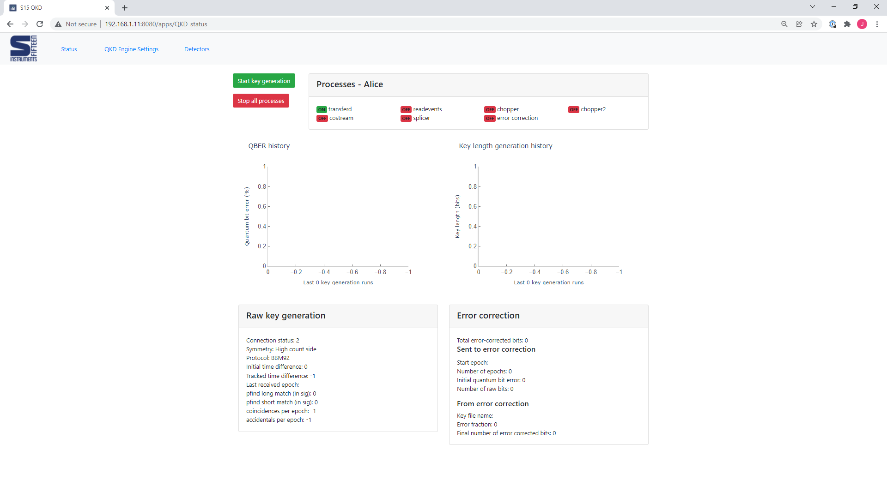
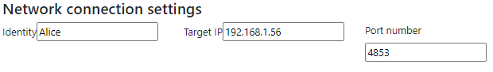
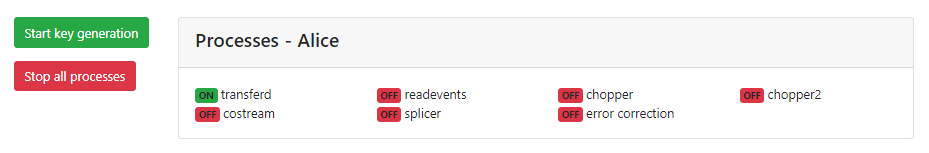

========
Layout
========

This page will talk about the layout of the QKDServer web UI and its various settings. The following setup was done with two devices with the following characteristics:

* Device 1: IP - 192.168.1.11. Ports - 4853, 8000
* Device 2: IP - 192.168.1.56  Ports - 4853, 8000

When running the container, the ports are published in the following manner (container -> public): 4853 -> 4853, 8000 -> 8080. The public ports are the ones used for
communication externally.

The ``QKDServer`` web GUI can be accessed by typing in the IP address of the device hosting the server code and associated port number into the address bar of a web browser.
In the example below, the example below, the server code is hosted by a device at IP address 192.168.1.11 through port 8080. This port number is the published port set
during the ``docker run`` command. (Insert link to command)

There are three tabs to the UI -  'Status', 'QKD Engine Settings' and 'Detectors'. Before running, go to the *QKD Engine Settings* tab (top left) and modify the target IP 
and port settings. 

Since the example shown is for the device at '...56', the target IP is the device at '...11'. Next, recall the two ports - one to serve the webpages (8080) and one for the QKD devices to talk to each other (4853). We input the latter (4853) into the port settings.

On both devices, head back to the 'Status' tab and hit the big green *Start Key Generation* button at the top to start. The order is unimportant.

The processes window will display the running status of key QKDServer services.
